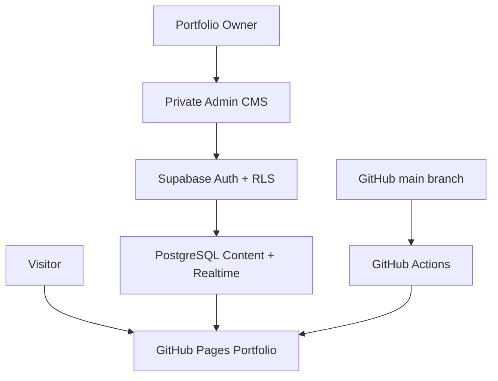

<div align="center">


<a href="https://git.io/typing-svg">
  
</a>

<p>
  <a href="https://ea-arnob-07.github.io/Arnob-Portfolio/">
    
  </a>
  <a href="https://ea-arnob-07.github.io/Arnob-Portfolio/admin/">
    
  </a>
  <a href="mailto:eaarnob178@gmail.com?subject=We%E2%80%99d%20Like%20to%20Discuss%20an%20Opportunity.">
    
  </a>
</p>

<p>
  
  
  
  
</p>

</div>

---

## The Portfolio

This is the personal portfolio of **Estiuk Arafat Arnob**—a Computer Science
and Engineering student, machine-learning builder, data scientist, and
Explainable AI researcher based in Dhaka, Bangladesh.

The experience combines a cinematic visual identity with real engineering:
an interactive Three.js particle universe, Framer Motion transitions, a
continuous professional-role carousel, glassmorphism interfaces, responsive
mobile layouts, and a secure Supabase-powered content management system.

> **I turn complex technical problems into clear, working systems.**

| Professional snapshot | Details |
| --- | --- |
| Name | Estiuk Arafat Arnob |
| Focus | AI · ML · Data Science · XAI |
| Roles | ML Engineer · Data Scientist · XAI Researcher · AI Enthusiast · Software Developer |
| Degree | B.Sc. in Computer Science & Engineering |
| University | Daffodil International University |
| Academic performance | CGPA 4.00 / 4.00 |
| Location | Dhaka, Bangladesh |
| Research | Explainable AI, healthcare AI, multimodal evaluation |
| Availability | Open to internships, research collaborations, and AI projects |

## Live Access

| Destination | URL | Purpose |
| --- | --- | --- |
| Public portfolio | [ea-arnob-07.github.io/Arnob-Portfolio](https://ea-arnob-07.github.io/Arnob-Portfolio/) | Explore the complete interactive portfolio |
| Private admin CMS | [Portfolio Admin](https://ea-arnob-07.github.io/Arnob-Portfolio/admin/) | Manage portfolio content without editing code |
| Source repository | [github.com/ea-arnob-07/Arnob-Portfolio](https://github.com/ea-arnob-07/Arnob-Portfolio) | Source, history, and deployment workflow |

> [!IMPORTANT]
> Admin access is restricted to the approved owner account through Supabase
> Authentication and Row Level Security. No admin password or secret key is
> stored in this repository.

## Experience Highlights

<table>
  <tr>
    <td width="50%">
      <h3>Immersive 3D Environment</h3>
      <p>
        A live Three.js particle network creates depth, motion, and a futuristic
        AI-inspired atmosphere without distracting from the content.
      </p>
    </td>
    <td width="50%">
      <h3>Professional Motion System</h3>
      <p>
        Framer Motion, reveal transitions, animated metrics, orbit labels,
        cursor effects, and a continuous role carousel make the interface feel
        alive.
      </p>
    </td>
  </tr>
  <tr>
    <td width="50%">
      <h3>Fully Editable CMS</h3>
      <p>
        Profile, About, Skills, Projects, Research, Experience, Certificates,
        Activities, Social links, and Contact content are editable from the
        private admin panel.
      </p>
    </td>
    <td width="50%">
      <h3>Responsive by Design</h3>
      <p>
        The hero, navigation, CONNECT dock, cards, 3D visuals, and admin
        workspace adapt carefully across desktop, tablet, and mobile screens.
      </p>
    </td>
  </tr>
</table>

## Technology Stack

<div align="center">


</div>

| Layer | Technology | Responsibility |
| --- | --- | --- |
| Application | Next.js 16 · React 19 · TypeScript 5 | Component architecture, routing, rendering, and type safety |
| Styling | Tailwind CSS 4 · custom responsive CSS | Dark neon theme, glass surfaces, grids, and mobile layouts |
| Motion | Framer Motion 12 | Scroll progress, staged reveals, transitions, and micro-interactions |
| 3D graphics | Three.js | Animated particle network and immersive background depth |
| Content platform | Supabase | PostgreSQL content, Authentication, Storage, Realtime, and RLS |
| Deployment | GitHub Actions · GitHub Pages | Automated static export and production publishing |
| Quality | ESLint · TypeScript · production builds | Static analysis and deployment verification |

## System Architecture



The public site can only read published content. Authenticated write operations
are checked by database-level policies against the approved admin email.
Realtime events, same-browser update signals, focus refreshes, and a quiet
fallback refresh keep open portfolio tabs current.

## Editable Content

The admin dashboard provides code-free control over:

- Name, profile picture, availability badge, location, focus line, and animated roles
- Hero statistics and all six labels around the profile image
- About paragraphs, professional highlights, and information rows
- Skill tabs, categories, skills, proficiency levels, and technology chips
- Recruiter snapshot, proof points, academic metrics, and hiring CTA
- Projects, descriptions, technologies, features, GitHub links, and live links
- Research cards, status labels, descriptions, and research tags
- Experience timeline roles, organizations, dates, icons, and descriptions
- Certificates, issuers, badges, icons, issue dates, and credential links
- Workshop points, activities, section headings, and footer content
- Email, phone, university, location, map label, and contact-form text
- GitHub, LinkedIn, Facebook, Gmail, social cards, and the CONNECT dock

All repeatable cards include position controls. Projects and certificates can
be published as drafts, reordered after creation, moved to **Recently
Deleted**, and restored later. Content edits do not require a new deployment.

## Portfolio Sections

1. **Hero** — identity, live status, role carousel, metrics, and orbit profile
2. **About** — academic background, professional story, and focus areas
3. **Skills** — machine learning, XAI, programming, databases, tools, and media
4. **Recruiter Snapshot** — academic proof, research energy, and hiring CTA
5. **Projects** — software engineering, system administration, and compilers
6. **Research** — healthcare XAI and multimodal AI evaluation
7. **Experience** — research and academic project leadership
8. **Certifications** — verified learning, competitions, and achievements
9. **Workshops & Activities** — IoT learning and community participation
10. **Social & Contact** — direct professional connections and opportunity form

## Featured Projects

### ATM Machine System

A Java Swing and MySQL banking simulation with secure PIN authentication,
account operations, fund transfers, transaction history, JDBC integration, and
receipt generation.

### Shell-Based System Administration Toolkit

A modular Bash CLI that automates monitoring, disk cleanup, backup management,
system-health analysis, student management, attendance tracking, and CSV
reporting.

### LogicScript Compiler

A lightweight interpreter-based compiler for a custom logic language,
demonstrating lexical analysis with Flex, grammar and parsing with Bison, AST
processing, semantic analysis, and execution.

## Research Direction

- **Explainable AI for Drug Addiction Prediction & Prevention**  
  Transparent healthcare classifiers using SHAP, LIME, feature importance,
  Random Forest, and interpretable risk analysis.

- **AI-Based Automated Presentation Evaluation System**  
  A multimodal assessment system combining NLP and computer vision to evaluate
  presentation content and delivery.

## Run Locally

### Prerequisites

- Node.js `22.13.0` or newer
- npm
- A Supabase project for CMS features

### Installation

```bash
git clone https://github.com/ea-arnob-07/Arnob-Portfolio.git
cd Arnob-Portfolio
npm install
npm run dev
```

Open the local URL printed in the terminal—normally:

```text
http://localhost:3000
```

Admin dashboard:

```text
http://localhost:3000/admin
```

### Environment

Create `.env.local` from `.env.example` when using a different Supabase
project:

```env
NEXT_PUBLIC_SUPABASE_URL=your-project-url
NEXT_PUBLIC_SUPABASE_PUBLISHABLE_KEY=your-publishable-key
```

Only a browser-safe **publishable key** belongs in frontend environment
variables. Never expose a database password, secret key, or `service_role` key.

## One-Time Supabase Setup

1. Create or open the Supabase project.
2. Go to **SQL Editor** and create a query.
3. Paste the complete contents of `supabase/schema.sql`.
4. Press **Run**.
5. Open **Authentication → URL Configuration**.
6. Set the Site URL:

   ```text
   https://ea-arnob-07.github.io/Arnob-Portfolio/
   ```

7. Add both allowed redirects:

   ```text
   https://ea-arnob-07.github.io/Arnob-Portfolio/admin
   https://ea-arnob-07.github.io/Arnob-Portfolio/admin/
   ```

8. Open the live Admin CMS, create the approved owner account if needed,
   confirm the email, and sign in.

The schema is idempotent and safe to run again after a CMS schema update. It
creates content tables, recoverable deletion fields, seed content, Storage,
Realtime publication entries, grants, functions, and Row Level Security
policies.

## Deploy to GitHub Pages

The repository includes `.github/workflows/deploy.yml`.

1. Push the complete project to the `main` branch.
2. Open **GitHub → Repository Settings → Pages**.
3. Set **Source** to **GitHub Actions**.
4. Open the **Actions** tab and wait for the deployment to complete.
5. Visit the live portfolio.

Every new push to `main` triggers a fresh production build and deployment.
Normal content updates from the Admin CMS do **not** require a GitHub push.

## Security Model

- Supabase Auth protects the private admin dashboard.
- PostgreSQL Row Level Security protects all write operations.
- Public visitors can read only published, non-deleted content.
- Admin authorization is checked by the database, not only by the interface.
- Secret and `service_role` keys are intentionally excluded.
- Project and certificate deletion is recoverable from the admin dashboard.
- The contact form opens a prefilled Gmail compose window instead of exposing a mail server.

## Content Maintenance

| Change | What to do |
| --- | --- |
| Edit text, skills, research, experience, or contact details | Use the Admin CMS and save the section |
| Add or reorder projects and certificates | Use the Admin CMS |
| Restore a deleted project or certificate | Open **Recently Deleted** |
| Change design, animation, layout, or application behavior | Update the code and push to `main` |
| Change repository name or production domain | Update `basePath` and Supabase Auth URLs |
| Receive a Supabase inactivity warning | Open or resume the project from the Supabase dashboard |

## Connect

<div align="center">

<a href="https://github.com/ea-arnob-07">
  
</a>
<a href="https://www.linkedin.com/in/estiuk-arafat-arnob-0350ba34a">
  
</a>
<a href="mailto:eaarnob178@gmail.com?subject=We%E2%80%99d%20Like%20to%20Discuss%20an%20Opportunity.">
  
</a>
<a href="https://www.facebook.com/share/1JD8Gt7NK7/?mibextid=wwXIfr">
  
</a>

<br /><br />


<br />


</div>

---

<div align="center">

### Research mindset. Builder energy.

Building intelligent solutions through machine learning, data science, and
explainable AI—turning raw information into meaningful, interpretable impact.

**If you are building something ambitious, let's start a conversation.**

<br />

<sub>Designed and engineered by Estiuk Arafat Arnob · Dhaka, Bangladesh</sub>


</div>
